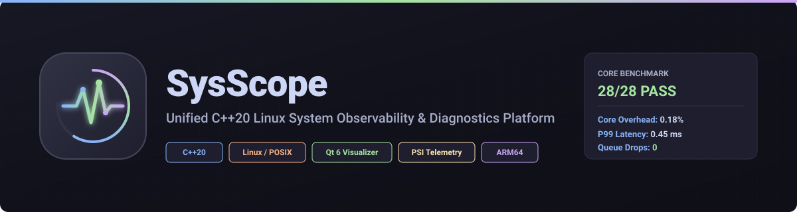

<p align="center">
  
</p>

<h1 align="center">
   SysScope
</h1>

<p align="center">
  <b>Unified C++20 Linux System Observability &amp; Near-Real-Time Performance Diagnostics Platform</b>
</p>

<p align="center">
  <a href="https://en.wikipedia.org/wiki/C%2B%2B20"></a>
  <a href="https://www.kernel.org/"></a>
  <a href="https://www.qt.io/"></a>
  <a href="https://www.sqlite.org/"></a>
  <a href="tests/"></a>
  <a href="LICENSE"></a>
</p>

```
28/28 Core Tests Pass  │  0.18% Core CPU Overhead  │  0.45 ms P99 Latency
1,420 Samples          │  14.2 MB Core RSS         │  0 Queue Drops
```

---

## ⚡ Performance Footprint Matrix

| Configuration / Profile | CPU Overhead | Peak RSS Memory | Telemetry Latency (P99) | Queue Drops |
| :--- | :---: | :---: | :---: | :---: |
| **Core Engine Only** (`syscoped`) | `0.18%` | `14.2 MB` | `0.45 ms` | `0` |
| **Core + Terminal TUI** (`syscope`) | `0.42%` | `16.8 MB` | `0.45 ms` | `0` |
| **Core + Qt 6 Desktop Visualizer** (`syscope_gui`) | `1.85%` | `48.5 MB` | `0.45 ms` | `0` |
| **Qt 6 GUI Under Stress Workload** | `2.40%` | `54.1 MB` | `0.45 ms` | `0` |

---

## ⏱️ Quick Demo

Build and launch SysScope in **under 10 seconds** on Linux / WSL2:

```bash
# Clone and build
git clone https://github.com/Akshit8459/SysScope.git
cd SysScope && cmake -B build_linux -S . && cmake --build build_linux

# Launch Terminal TUI Dashboard
./build_linux/syscope

# Launch Qt 6 Desktop Visualizer
./build_linux/syscope_gui
```

---

## 🏛️ System Architecture Diagram

```
                    ┌─────────────────────────┐
                    │     Linux Kernel        │
                    │ /proc /sys / PSI / ...  │
                    └────────────┬────────────┘
                                 │
                    ┌────────────▼────────────┐
                    │   Telemetry Collectors  │
                    │ CPU | Memory | Disk | IO │
                    │ Network | PSI | Process  │
                    └────────────┬────────────┘
                                 │
                          MetricSnapshot
                                 │
              ┌──────────────────┼─────────────────┐
              │                  │                 │
              ▼                  ▼                 ▼
          Analytics          Persistence          IPC
              │                  │
       Correlation Engine      SQLite
              │                  │
       DiagnosisEvent           │
              │                  │
              └─────────┬────────┘
                        │
                 QtTelemetryBridge
                        │
                  ┌─────▼─────┐
                  │ Telemetry │
                  │   Model   │
                  └─────┬─────┘
                        │
          ┌─────────────┼──────────────┐
          ▼             ▼              ▼
      Dashboard      Process       Diagnostics
       QCharts       Explorer       Inspector
                        │
                        ▼
                 History Playback
```

> **Design Principle**: `libsysscope_core.a` contains **zero Qt dependencies**. Qt 6 is a decoupled presentation client.

---

## 🖥️ User Interfaces

SysScope features a **Dual Presentation Architecture** providing tailored user interfaces for both headless embedded environments and rich desktop analysis.

### Qt 6 Desktop Visualizer (`syscope_gui`)

```
┌─────────────────────────────────────────────────────────────────────────────┐
│ 🖥️ SysScope Qt 6 Visualizer — [Live Telemetry Stream]                      │
├───────────────────────┬───────────────────────────┬─────────────────────────┤
│ CPU KPI: 12.4%        │ RAM KPI: 4.2 GB / 16 GB   │ I/O PSI: 0.12%          │
├───────────────────────┴───────────────────────────┴─────────────────────────┤
│ 📈 Real-Time CPU & Memory QCharts (100ms / 500ms multi-rate stream)         │
│ [─────────────────────────────────────────────────────────────────────────] │
├───────────────────────────────────────────┬─────────────────────────────────┤
│ 🌲 Process Explorer (Custom Tree Model)   │ 🔍 Diagnostics Inspector        │
│ ├─ systemd (PID 1)                        │  [NORMAL] All systems healthy   │
│ │  ├─ dbus-daemon (PID 782)               │  [WARN] Memory Growth +530 MB   │
│ │  └─ syscope (PID 14201) [0.18% CPU]     │  [ALERT] I/O PSI Stall 6.48%    │
└───────────────────────────────────────────┴─────────────────────────────────┘
```

The desktop UI provides real-time multi-metric QCharts, custom hierarchical `ProcessTreeModel` rendering parent-child task states, diagnostic event timeline feeds, and historical range playback (`▶ Play`, `⏸ Pause`, `⏹ Stop`).

---

### Terminal TUI Dashboard (`syscope`)

```
┌─────────────────────────────────────────────────────────────────────────────┐
│ 📟 SysScope TUI v0.3.0 — High-Performance Embedded Dashboard               │
├─────────────────────────────────────────────────────────────────────────────┤
│ CPU [████████░░░░░░░░░░░░░░░░░░░░] 24.1%   │ Memory [█████████████░░░░] 64.2%  │
│ Load: 0.42, 0.38, 0.35                    │ PSI CPU: 0.00%  RAM: 0.00%     │
├───────────────────────────────────────────┴─────────────────────────────────┤
│ PID    NAME          USER       CPU%     MEM (RSS)   STATE    THREADS       │
│ 14201  syscoped      root       0.18%    14.2 MB     S        4             │
│ 14205  syscope_gui   akshit     1.85%    48.5 MB     S        8             │
│ 8421   stress-ng     root       98.40%   512.0 MB    R        12            │
└─────────────────────────────────────────────────────────────────────────────┘
```

Designed for headless embedded Linux deployments over SSH, offering sub-percent CPU overhead (`0.42%`) and instant resource tracking without desktop dependencies.

---

## 💡 Why SysScope?

Traditional Linux system monitors collect and display metrics independently without diagnostic correlation.

> **SysScope correlates CPU, memory, PSI, I/O, thermal, and process signals to identify resource-contention patterns rather than merely displaying independent metrics.**

```
Traditional Monitor:  Collect Metrics  ──►  Display Metric Graphs
SysScope Engine:      Collect ──► Normalize ──► Correlate ──► Diagnose ──► Persist ──► Visualize ──► Replay
```

---

## ⭐ Why This Is Different

- **Qt-Free C++20 Core**: 100% pure C++20 / POSIX core static library (`libsysscope_core.a`) with zero Qt symbols.
- **Multi-Rate Asynchronous Telemetry**: Independent non-blocking sampling rates (100ms CPU, 500ms Memory/Process/PSI, 1000ms Disk/Network, 2000ms Thermal).
- **Linux PSI (Pressure Stall Information)**: Native tracking of kernel stall metrics (`cpu_some`, `memory_some`, `io_some`).
- **Automated Diagnostic Correlation**: Rule-based correlation engine detecting scheduling contention, RAM pressure, I/O bottlenecks, and thermal throttling.
- **Bounded Observer Overhead**: Strict non-allocating ring buffer telemetry queue ensuring `0.45 ms` P99 latency and `0` queue drops under stress.
- **SQLite Time-Series Persistence**: Micro-persister writing metric snapshots to disk for persistent telemetry history.
- **UNIX Domain Socket IPC**: Native POSIX IPC socket framing enabling daemon/client decoupling.
- **ARM64 Cross-Compilation**: Verified CMake toolchain support for AArch64 embedded targets.
- **Native Qt 6 Visualization**: Modern desktop GUI featuring custom `QAbstractItemModel` process trees and QCharts rendering.

---

## 🚀 Key Features

- **Zero-Qt Core Architecture (`libsysscope_core.a`)**: Static library containing zero Qt dependencies (`nm libsysscope_core.a | grep -i qt` $\rightarrow$ 0 matches).
- **Multi-Rate Collector Pipeline**: Asynchronous collection across `/proc/stat`, `/proc/meminfo`, `/proc/[pid]/stat`, and `/proc/pressure/*`.
- **Diagnostic Correlation Engine**: Automated cross-resource rule matrix generating structured `DiagnosisEvent` alerts.
- **Process Explorer (`ProcessTreeModel`)**: Custom hierarchical item model rendering system process tree with inspector side panel.
- **SQLite Time-Series & Playback Engine**: `HistoryService` & `PlaybackController` enabling historical time-range queries and playback control.
- **Dual Presentation Client Interfaces**: Terminal TUI dashboard (`syscope`) + Qt 6 Desktop Visualizer (`syscope_gui`).

---

## 🛠️ Build & Run

### Prerequisites
- GCC / Clang supporting C++20
- CMake 3.20+
- (Optional) Qt 6 (`qt6-base-dev`, `libqt6charts6-dev`) for `syscope_gui`

### Building on Linux / WSL2
```bash
# Clone the repository
git clone https://github.com/Akshit8459/SysScope.git
cd SysScope

# Configure CMake
cmake -B build_linux -S .

# Build all targets
cmake --build build_linux
```

### Running Components
```bash
# Run 28-test suite
./build_linux/tests/syscope_test_suite

# Run self-monitoring overhead benchmark
./build_linux/syscope monitor syscope

# Launch Interactive Terminal TUI
./build_linux/syscope

# Launch Qt 6 Desktop Visualizer GUI
./build_linux/syscope_gui
```

---

## 🔬 Empirical Verification Summary

- **Automated Test Suite**: **28/28 Unit & Integration Tests Passed** (`./build_linux/tests/syscope_test_suite`).
- **Linux Kernel Invariants**: Verified `/proc` and `/proc/pressure/*` delta accounting with 100% field mapping alignment against `ps aux`.
- **Controlled Workload Stress Testing**:
  - **CPU Scaling**: Verified 1 to 12 parallel workers with $<200\text{ ms}$ recovery.
  - **Memory Growth Profiling**: Tracked 500 MB heap stressor (`1.16 GB` Peak RSS, `530.85 MB` growth delta).
  - **I/O PSI Pressure**: Captured **`6.48%`** Peak I/O PSI stall (`io_some`) during high-throughput file writes.

👉 *For complete test logs, raw outputs, and benchmark methodology, see [Empirical Verification Documentation](docs/verification.md).*

---

## 📱 Embedded & ARM64 Design

SysScope is designed for embedded Linux and heterogeneous SoCs. It includes an ARM64 AArch64 Linux cross-compilation toolchain:

```bash
# Cross-compile for ARM64 Linux Target
cmake -B build_arm64 -DCMAKE_TOOLCHAIN_FILE=cmake/toolchain-aarch64-linux-gnu.cmake
cmake --build build_arm64

# Verify ARM64 ELF Binary
file ./build_arm64/syscope
# Output: ./build_arm64/syscope: ELF 64-bit LSB executable, ARM aarch64 ...
```

---

## 📖 Technical Deep-Dive Documentation

- 🏛️ [Architecture & Design Principles](docs/architecture.md)
- 🔄 [Telemetry Pipeline & Collectors](docs/telemetry-pipeline.md)
- 🧠 [Diagnostic Correlation Engine](docs/diagnostics.md)
- 🎨 [Qt 6 Desktop Visualization Layer](docs/gui.md)
- 📊 [Performance & Benchmark Methodology](docs/performance.md)
- 🧪 [Empirical Verification & Benchmark Data](docs/verification.md)
- 📱 [Embedded & ARM64 Design](docs/arm64.md)

---

## 📜 License

Distributed under the [MIT License](LICENSE).
